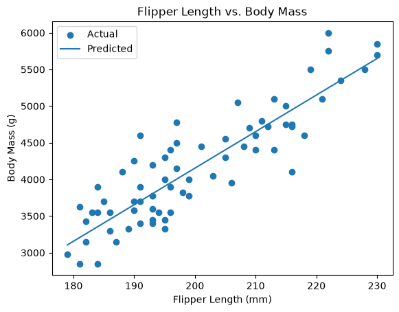
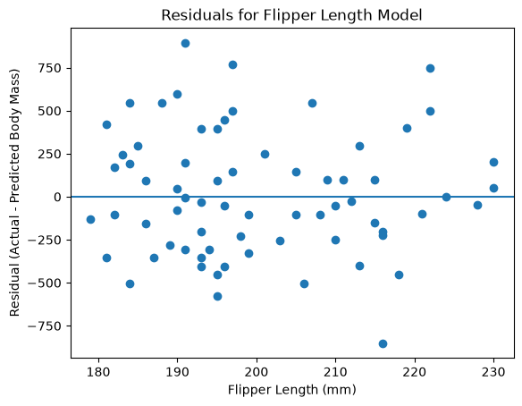

# datafun-06-ml


[](./pyproject.toml)
[](https://docs.astral.sh/uv/)
[](https://docs.astral.sh/ty/)
[](https://docs.astral.sh/ruff/)
[](https://jupyter.org/)
[](https://docs.marimo.io/)
[](https://zensical.org/)
[](./LICENSE)

## Predictive Analytics Project
**Author: Lindsay Miller**
> Professional Python project: linear regression and predictive analytics.

## Project Goal

This project uses **linear regression** to examine whether
**flipper length (mm)** can be used to predict **body mass (g)**
in the Palmer Penguins dataset.

The goal is to compare a simple linear regression model with a baseline model,
evaluate the model using RMSE and R-squared, and examine prediction and residual
plots to determine how useful flipper length is for predicting body mass.

## How to Run the Project

From the project root folder in the VS Code terminal, run:

```shell
uv run python -m datafun.app
```

## My Analysis

For this project, I used the Palmer Penguins dataset to investigate whether
**flipper length (mm)** can be used to predict **body mass (g)**.

I used a simple linear regression model and compared its performance with a
baseline model that predicted the mean body mass.

### Key Results

| Model | RMSE | R-squared |
|---|---:|---:|
| Baseline | 751.68 | -0.002 |
| Linear Regression | 356.05 | 0.775 |

The linear regression model performed much better than the baseline model.
The RMSE decreased from 751.68 grams to 356.05 grams.

The model R-squared value was 0.775, meaning that approximately 77.5% of the
variation in body mass in the test data was explained by flipper length.

### Prediction Plot



### Residual Plot



### Summary

The results show a clear positive relationship between flipper length and
body mass. Penguins with longer flippers generally had greater body mass.

The residuals were scattered above and below zero, showing that the model
sometimes overpredicted and sometimes underpredicted body mass.

Overall, flipper length appears to be a useful predictor of body mass for
this dataset, although flipper length alone does not explain all of the
variation in body mass.

## Standard Process

```text
OBSERVE
DECLARE
PREPARE
SPLIT
BASELINE
TRAIN
PREDICT
EVALUATE
VISUALIZE
ASSESS
```

Example:

```text
TRAIN       LinearRegression
PREDICT     on X_test
EVALUATE    baseline vs model on y_test
```

## Important Folders and Files

- **data/raw** - raw data
- **docs/** - project narrative and documentation
- **src/datafun** - supporting Python code
- **pyproject.toml** - project configuration
- **zensical.toml** - documentation configuration

## Common Workflow

See the project documentation for details about this analysis and workflow.

## Success

After completing Phase 1. **Start & Run**, you'll have the example project,
running on your machine.
A new file `project.log` will appear in the root project folder
and running the example script will print out:

```shell
===================================
END main() - Executed successfully!
===================================
```

## Command Reference

The commands below are used in the workflow guide above.
They are provided here for convenience.

Follow the guide for the **full instructions**.

<details>
<summary>Show command reference</summary>

### In a machine terminal (open in your `Repos` folder)

Open a machine terminal in your `Repos` folder:

```shell
git clone https://github.com/lindsaymiller1807/datafun-06-ml.git

cd datafun-06-ml
code .
```

### In a VS Code terminal

These commands are listed for convenience.
See the project documentation for additional details.

Use VS Code menu option `Terminal` / `New Terminal` to open a **VS Code terminal**
in the root project folder.
Copy each command, paste into your terminal, and hit ENTER,
to run each command one at a time.

```shell
uv self update
uv python pin 3.14

uv python install
uv lock --upgrade
uv sync

uv run pre-commit install
uv run pre-commit autoupdate

git add -A
uv run pre-commit run --all-files
# repeat if changes were made by pre-commit tasks
git add -A
uv run pre-commit run --all-files

# run the penguin example: is there a linear relationship?
uv run python -m datafun.app

# do chores
uv run ruff format .
uv run ruff check . --fix
uv run ty check
uv run python -m pytest
uv run python -m zensical build

# save progress as you work
git add -A
git commit -m "your message here"
# repeat if changes were made (try the UP ARROW)
git add -A
git commit -m "your message here"

git push -u origin main
```

</details>

## Helpful Tips

- Use the **UP ARROW** and **DOWN ARROW** in the terminal
  to scroll through past commands.
- Use `CTRL+f` to find (and replace) text within a file.

## Much Can Be Ignored

- You do not need to add to or modify `tests/`.
  Tests are recommended and provided for example only.
- Many files are silent helpers.
  [Explore](https://denisecase.github.io/professional-python-project-explainer/)
  as you like, but most files are never touched.
- You do NOT need to understand everything;
  let understanding build over time.

## As Needed

If VS Code does not automatically use the new `.venv` environment:

1. Open the Command Palette (`Ctrl+Shift+P`).
2. Run **Python: Select Interpreter**.
3. Select the interpreter from this project's `.venv` folder.

If VS Code still does not recognize the environment or newly installed tools:

1. Open the Command Palette (`Ctrl+Shift+P`).
2. Run **Developer: Reload Window**.

## Troubleshooting >>>

If you see something like this in your terminal: `>>>` or `...`
You accidentally started Python interactive mode.
It happens.
Press `Ctrl c` (both keys together) or `Ctrl+Z` then `Enter` on Windows.

## Documentation

- [Documentation](https://lindsaymiller1807.github.io/datafun-06-ml/)

## Data Card

- [Palmer Penguins Data Card](./docs/data-card.md)

## Annotations

- [.annotations/annotations.md](./.annotations/annotations.md)

## Citation

- [CITATION.cff](./CITATION.cff)

## License

This project is licensed under the [MIT License](./LICENSE).
